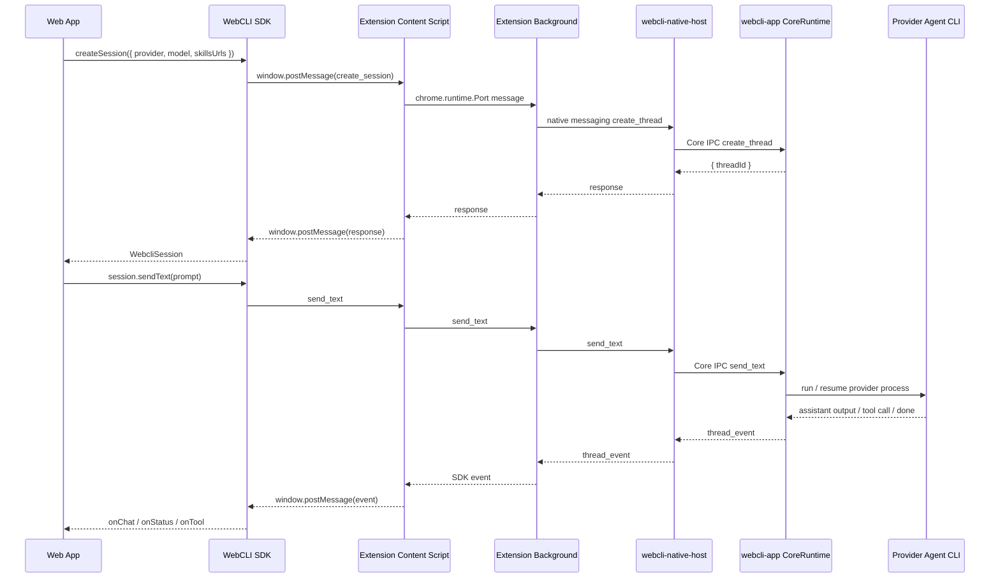

# WebCLI

WebCLI 是一套讓網頁前端可以呼叫本機 AI coding agent 的橋接架構。

它的核心目標是：**讓 Web App 透過 SDK 建立 agent session、傳送使用者訊息、接收 agent 串流回應，並在 agent 需要操作前端狀態時，把 tool call 安全地交回 Web App 處理。**

整體資料流可以想成：

```txt
Web App / SDK
  ↓ window.postMessage
Chrome Extension Content Script
  ↓ chrome.runtime.Port
Chrome Extension Background
  ↓ Chrome Native Messaging
webcli-native-host
  ↓ Core IPC
webcli-app Desktop Runtime
  ↓ provider CLI process
Codex / Gemini / OpenCode / Cursor / Claude Code agent
```

Web App 不直接碰本機 process，也不需要自己開 localhost server。SDK 只負責和 extension 溝通；extension 負責把請求送到 native host；desktop app 是唯一的 CoreRuntime owner，真正負責建立 session、管理 provider process、轉發事件與處理 tool result。

---

## Repo 結構

```txt
sdk/        Web App 端使用的 TypeScript SDK
extension/  Chrome extension，負責 page bridge 與 native messaging bridge
desktop/    Tauri desktop app、CoreRuntime、native host、webcli-tool
```

---

## SDK 使用前提

WebCLI SDK 必須在瀏覽器頁面環境中執行，並且需要：

1. 使用者已安裝 WebCLI Chrome Extension。
2. 使用者已啟動 WebCLI Desktop App。
3. Desktop App 已註冊 Chrome Native Messaging host。
4. 目標 provider CLI 已安裝在使用者本機，例如 `codex`、`gemini`、`opencode`、`cursor` 或 `claude`。

SDK 不適合直接在 Node.js、SSR server 或 background worker 裡使用；它需要瀏覽器的 `window.postMessage` 作為 page 到 extension 的橋。

---

## 安裝與引用 SDK

SDK 套件位於 `sdk/`：

```bash
cd sdk
npm install
npm run build
```

在 Web App 端引用：

```ts
import { Webcli } from "webcli";
```

如果尚未發布到 npm，可以先用本地 path 安裝：

```bash
npm install ../path/to/web-cli/sdk
```

---

## 最小使用範例

```ts
import { Webcli } from "webcli";

const webcli = new Webcli();

const session = await webcli.createSession({
  provider: "codex",
  model: "gpt-5",
  skillsUrls: [
    "https://example.com/tools.json",
    "https://example.com/tools.md",
  ],
});

session.onChat((text) => {
  // agent 的文字串流增量
  console.log(text);
});

session.onStatus((status) => {
  // idle | running | waiting_tool_result | ended | error
  console.log("status", status);
});

session.onError((error) => {
  console.error(error.code, error.message, error.details);
});

await session.sendText("請幫我分析目前頁面的狀態");
```

`sendText()` 會在本輪 agent 回應完成後 resolve；如果 session 已經在處理上一個 prompt，新的 `sendText()` 會被拒絕，避免同一個 session 同時跑多個請求。

---

## 建立 Session

### 指定 provider 與 model

```ts
const session = await webcli.createSession({
  provider: "opencode",
  model: "ollama/qwen2.5-coder:14b",
});
```

目前 SDK 支援的 provider code：

| Provider | Code | model 範例 |
| --- | --- | --- |
| Codex | `codex` | `gpt-5` |
| Gemini | `gemini` | provider 自己支援的 model id |
| OpenCode | `opencode` | `ollama/qwen2.5-coder:14b` |
| Cursor | `cursor` | `gpt-5` |
| Claude Code | `claude` | `sonnet` |

### 使用 Desktop App 預設 provider

如果 Desktop App 已設定 default provider，可以不傳 `provider`：

```ts
const session = await webcli.createSession({
  skillsUrls: ["https://example.com/tools.md"],
});
```

這會先讀取 Desktop App 的 `defaultProvider` 與 `defaultModel`。如果沒有設定 default provider，SDK 會拋出 `DEFAULT_PROVIDER_NOT_SET`。

### 只指定 provider

```ts
const session = await webcli.createSession({
  provider: "codex",
});
```

如果 Desktop App 的 default provider 也是 `codex`，SDK 會沿用 default model；如果不是，則只傳 provider，不強制帶 model。

---

## 查詢 Providers

```ts
const providers = await webcli.listProviders();

for (const provider of providers) {
  console.log(provider.code, provider.available, provider.path, provider.error);
}
```

回傳格式：

```ts
type ProviderInfo = {
  name: string;
  code: "codex" | "gemini" | "opencode" | "cursor" | "claude";
  path: string | null;
  available: boolean;
  error: string | null;
};
```

`available: false` 通常代表該 provider CLI 沒有安裝，或不在 PATH 裡。

---

## 讀取 Desktop App 設定

```ts
const settings = await webcli.getSettings();

console.log(settings.defaultProvider);
console.log(settings.defaultModel);
```

回傳格式：

```ts
type WebCliSettings = {
  defaultProvider: "codex" | "gemini" | "opencode" | "cursor" | "claude" | null;
  defaultModel: string | null;
};
```

---

## 接收 Agent 回應

```ts
const chunks: string[] = [];

session.onChat((text) => {
  chunks.push(text);
  render(chunks.join(""));
});
```

`onChat()` 收到的是文字增量，不一定是一整句，也不一定是一整段。UI 通常需要自己累積成完整訊息。

---

## 監聽 Session 狀態

```ts
session.onStatus((status) => {
  switch (status) {
    case "idle":
      break;
    case "running":
      break;
    case "waiting_tool_result":
      break;
    case "ended":
      break;
    case "error":
      break;
  }
});
```

常見狀態：

| 狀態 | 意義 |
| --- | --- |
| `idle` | session 可接收下一個 prompt |
| `running` | agent 正在處理使用者輸入 |
| `waiting_tool_result` | agent 發出 tool call，正在等待前端回傳結果 |
| `ended` | session 已結束 |
| `error` | session 發生錯誤 |

---

## Tool Calling：讓 Agent 操作 Web App

WebCLI 的 tool calling 流程是：

1. Web App 在 `skillsUrls` 提供 tool 說明，例如 `tools.md` 與 `tools.json`。
2. Desktop Runtime 把 skills 放進 agent sandbox。
3. Agent 需要前端資料或操作時，在本機執行 `webcli-tool tool-call ...`。
4. Desktop Runtime 收到 tool call 後，透過 native host 與 extension 送回 SDK。
5. SDK 觸發 `session.onTool()`。
6. Web App 執行對應工具並 return result。
7. SDK 自動把 result submit 回 Desktop Runtime，再交給 agent 繼續推理。

範例：

```ts
session.onTool(async (tool, args) => {
  if (tool === "get_current_page") {
    return {
      url: location.href,
      title: document.title,
      selectedText: window.getSelection()?.toString() ?? "",
    };
  }

  if (tool === "update_counter") {
    const { delta } = args as { delta: number };
    counter.value += delta;
    return {
      counter: counter.value,
      delta,
    };
  }

  return {
    error: {
      code: "TOOL_NOT_FOUND",
      message: `Unknown tool: ${tool}`,
    },
  };
});
```

`onTool()` 的回傳值必須可以 JSON serialize。SDK 會自動把回傳值送回 runtime，不需要手動呼叫 `submit_tool_result`。

---

## Resume 既有 Session

如果你有保存 `sessionId`，可以重新接回既有 session：

```ts
const session = await webcli.resumeSession("thread_abc123");

session.onChat((text) => {
  console.log(text);
});

await session.sendText("繼續剛剛的工作");
```

---

## 結束 Session

```ts
await session.end();
```

結束後，該 session 不能再呼叫 `sendText()`。如果需要新的對話，請重新 `createSession()`。

---

## 錯誤處理

建議所有 SDK 操作都包在 `try/catch`，並同時註冊 `onError()`：

```ts
session.onError((error) => {
  console.error("session error", error);
});

try {
  await session.sendText("請幫我修改這段內容");
} catch (error) {
  console.error("send failed", error);
}
```

常見錯誤：

| code | 可能原因 |
| --- | --- |
| `EXTENSION_UNAVAILABLE` | SDK 不在瀏覽器頁面中執行，或 extension 無法連線 |
| `EXTENSION_DISCONNECTED` | extension bridge 中斷 |
| `SDK_BRIDGE_TIMEOUT` | extension 沒有在 timeout 內回應 |
| `NATIVE_HOST_UNAVAILABLE` | Chrome Native Messaging host 無法連線 |
| `DEFAULT_PROVIDER_NOT_SET` | Desktop App 尚未設定 default provider |
| `DEFAULT_PROVIDER_UNAVAILABLE` | default provider CLI 不可用 |
| `SESSION_BUSY` | 同一個 session 已有 prompt 正在執行 |
| `SESSION_ENDED` | session 已結束 |
| `TOOL_HANDLER_NOT_FOUND` | agent 呼叫 tool，但 Web App 沒有註冊 handler |

---

## 頂層架構



### 每一層的責任

| 層級 | 責任 |
| --- | --- |
| SDK | 提供 Web App API、維護 session callback、處理 request timeout 與事件去重 |
| Content Script | 在 page world 與 extension world 之間轉送訊息 |
| Background | 管理 SDK channel、連線 native host、把 core event 轉成 SDK event |
| Native Host | Chrome Native Messaging 入口，轉送 request/event 到 Core IPC |
| Desktop Runtime | 唯一的 session/runtime owner，管理 thread、skills、provider process 與 tool request |
| Agent CLI | 實際執行 Codex/Gemini/OpenCode/Cursor/Claude Code，並透過 `webcli-tool` 呼叫前端工具 |

---

## 開發流程

### 啟動 Desktop App

```bash
cd desktop
npm install
npm run tauri dev
```

### 載入 Chrome Extension

1. 開啟 `chrome://extensions`。
2. 開啟 Developer mode。
3. 點選 **Load unpacked**。
4. 選擇 `extension/` 資料夾。
5. 啟動或重啟 Desktop App，讓它註冊 native messaging host。

### 建置 SDK

```bash
cd sdk
npm install
npm run build
```

---

## 設計重點

- Web App 只依賴 SDK，不直接知道 native host 或 Core IPC 細節。
- Extension 是 Web App 與本機 runtime 的唯一瀏覽器橋接層。
- Desktop App 是唯一 CoreRuntime owner，避免 extension、native host、desktop 同時建立各自的 session state。
- Agent 不直接操作 Web App；它只能透過 `webcli-tool` 發出 tool call，再由 SDK 交給 Web App 決定是否執行。
- Tool result 由 Web App 回傳，runtime 再交給 agent，讓前端狀態與本機 agent 能保持同步。
